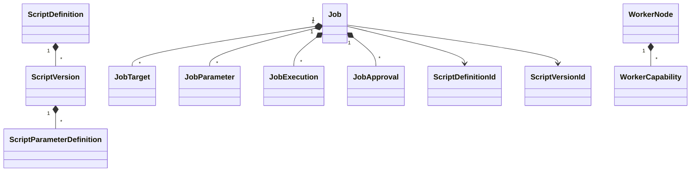

# Domain model

## Model

`ScriptDefinition` owns version identity and uniqueness. Each `ScriptVersion` owns typed parameter definitions, phases, report formats, hash metadata, publication, and immutability.

`Job` owns targets, supplied parameters, execution attempts, approval decisions, draft protection, submission validation, and lifecycle transitions. Submission captures an immutable `JobPolicySnapshot` from the matching published `ScriptDefinition` and `ScriptVersion`; it contains trusted risk, Execute-phase support, and both identifiers. Approval and read-only completion never accept policy overrides from callers. Public collections are read-only views.

Protected states are reachable only through intention-revealing operations that create or validate their required evidence. All actor, timestamp, lifecycle, and child-object validation occurs before aggregate fields or collections are mutated, so a failed operation leaves the aggregate unchanged.

`WorkerNode` owns capabilities and monotonic heartbeat state. `AuditEvent` defensively copies non-sensitive properties. `CredentialReference` represents only an external provider reference and never contains a raw credential.

Strong GUID-backed IDs prevent accidental identifier mixing. `ScriptName`, `ScriptVersionNumber`, `UserIdentity`, `TargetName`, `ChangeReference`, and `WorkerCapability` centralize validation and equality.

The Domain project owns no persistence, ASP.NET, SQL, PowerShell, file-system, Git, or serialization concerns. Persistence reconstruction patterns and storage mappings remain Phase 3 work.
