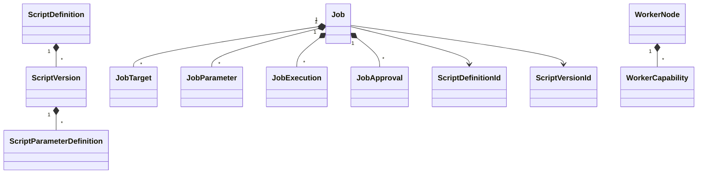

# Domain model

## Model

`ScriptDefinition` owns version identity, risk policy, and uniqueness. It rejects undefined risk values, duplicate semantic version numbers, and duplicate `ScriptVersionId` values before mutation. Each `ScriptVersion` owns typed parameter definitions, phases, report formats, hash metadata, publication, and immutability. Version construction rejects undefined phases and report formats, and publication rejects Execute-capable versions that do not also support DryRun.

`Job` owns targets, supplied parameters, execution attempts, approval decisions, draft protection, submission validation, and lifecycle transitions. Job creation rejects undefined requested phases. Submission requires an enabled script definition, a published selected version, a Phase 2 supported requested phase: `Validation`, `DryRun`, or `Execute`, and DryRun support for Execute requests. Submission captures an immutable `JobPolicySnapshot` from the matching published `ScriptDefinition` and `ScriptVersion`; it contains trusted risk, Execute-phase support, and both identifiers. Approval and read-only completion never accept policy overrides from callers. Public collections are read-only views.

Protected states are reachable only through intention-revealing operations that create or validate their required evidence. Validation-only and dry-run-only completions have dedicated operations. Execute-only states require `RequestedPhase == Execute`. A started `JobExecution` is completed only by the aggregate execution-outcome operation, which completes the attempt and terminalizes the job together; direct terminal job operations reject active attempts. All actor, timestamp, lifecycle, enum, and child-object validation occurs before aggregate fields or collections are mutated, so a failed operation leaves the aggregate unchanged.

`WorkerNode` owns capabilities and monotonic heartbeat state. `AuditEvent` defensively copies non-sensitive properties. `CredentialReference` represents only an external provider reference and never contains a raw credential.

Strong GUID-backed IDs are immutable reference records with no public parameterless constructor. Constructors reject `Guid.Empty`, factories use explicit `New()` methods, and aggregate/entity boundaries reject null IDs. `ScriptName`, `ScriptVersionNumber`, `UserIdentity`, `TargetName`, `ChangeReference`, and `WorkerCapability` centralize validation and equality. `UserIdentity` preserves display casing but uses ordinal case-insensitive equality and hash codes to match Windows account-name behavior in Phase 2.

The Domain project owns no persistence, ASP.NET, SQL, PowerShell, file-system, Git, or serialization concerns. Persistence reconstruction patterns and storage mappings remain Phase 3 work.
