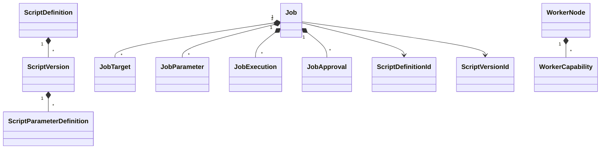

# Domain model

## Model

`ScriptDefinition` owns version identity, risk policy, and uniqueness. It rejects undefined risk values, duplicate semantic version numbers, and duplicate `ScriptVersionId` values before mutation. Detail updates validate both proposed fields before assigning either, so display name, description, and timestamp update atomically. Description remains optional and null normalizes to empty under the existing contract. Each `ScriptVersion` owns typed parameter definitions, phases, report formats, hash metadata, publication, and immutability. Version construction rejects undefined phases and report formats, and publication rejects Execute-capable versions that do not also support DryRun.

`Job` owns targets, supplied parameter bindings, execution attempts, approval decisions, draft protection, submission validation, and lifecycle transitions. Job creation rejects undefined requested phases. `JobParameter` stores only a parameter name and present serialized value; it does not store trusted parameter type or sensitivity. Null, empty, and whitespace values mean no explicit binding. The draft-only `ClearParameterValue` removes a binding case-insensitively, is safely idempotent, returns whether a binding existed, and treats every accepted clear command as an intentional actor/timestamp mutation. `SetParameterValue` routes canonical absence through that clear operation so stale or whitespace bindings cannot remain. Submission requires an enabled script definition, a published selected version, a Phase 2 supported requested phase: `Validation`, `DryRun`, or `Execute`, DryRun support for Execute requests, and parameter bindings that validate against the pinned `ScriptVersion`. Submission captures an immutable `JobPolicySnapshot` from the matching published `ScriptDefinition` and `ScriptVersion`; it contains trusted risk, Execute-phase support, PostValidation-phase support, and both identifiers. Approval, read-only completion, and post-validation entry never accept capability overrides from callers. Public collections are read-only views.

Protected states are reachable only through intention-revealing operations that create or validate their required evidence. Validation-only and dry-run-only completions have dedicated operations. Execute-only states require `RequestedPhase == Execute`. A started `JobExecution` is completed only by the aggregate execution-outcome operation, which completes the attempt and terminalizes the job together; direct terminal job operations reject active attempts. All actor, timestamp, lifecycle, enum, and child-object validation occurs before aggregate fields or collections are mutated, so a failed operation leaves the aggregate unchanged.

`WorkerNode` owns capabilities and monotonic heartbeat state. `AuditEvent` defensively copies non-sensitive properties. `CredentialReference` represents only an external provider reference and never contains a raw credential.

Strong GUID-backed IDs are immutable reference records with no public parameterless constructor. Constructors reject `Guid.Empty`, factories use explicit `New()` methods, and aggregate/entity boundaries reject null IDs. `ScriptName`, `ScriptVersionNumber`, `UserIdentity`, `TargetName`, `ChangeReference`, and `WorkerCapability` centralize validation and equality. `UserIdentity` preserves display casing but uses ordinal case-insensitive equality and hash codes to match Windows account-name behavior in Phase 2.

The Domain project owns no persistence, ASP.NET, SQL, PowerShell, file-system, Git, or serialization concerns. Phase 3 keeps persistence entities and mappings in Infrastructure. Domain aggregates expose internal validated rehydration factories to Infrastructure through `InternalsVisibleTo`; they do not expose public persistence constructors, public setters, or EF attributes. Rehydration rejects inconsistent identifiers, undefined enums, invalid timestamps, duplicate children, incomplete executions, and other corrupt stored state. Persisted `JobParameter` rows remain binding-only, and the pinned immutable script version stays authoritative before any value is exposed.

## Worker coordination model

`JobWorkKind` has exactly `DryRun` and `Execute`. A `JobLease` is aggregate-owned coordination state with a strong `JobLeaseId`, `WorkerNodeId`, work kind, positive fencing token, acquisition time, last-renewed time, and expiration. Timestamp and enum invariants are validated before construction or renewal. A job can own at most one lease, and rehydration rejects worker-controlled active states that lack the required lease.

Dry-run acquisition leaves the job in `DryRunQueued`; the future handler must explicitly enter `DryRunRunning`. Execute acquisition changes `ExecutionQueued` to `Claimed`. Safe release leaves DryRun queued or returns unstarted Execute work to `ExecutionQueued`. Completion removes the lease. Expiration recovery releases queued DryRun, requeues unstarted Execute, or moves active DryRun/Execute work to `TimedOut`; active execution recovery records a `TimedOut` execution outcome before removing the lease.

`WorkerNode.SynchronizeCapabilities` validates the entire proposed set before mutation, compares names case-insensitively, adds and updates configured values, removes stale values, and returns whether anything changed. `WorkerNode.IsLive` requires an enabled node and a heartbeat within the configured staleness window.
